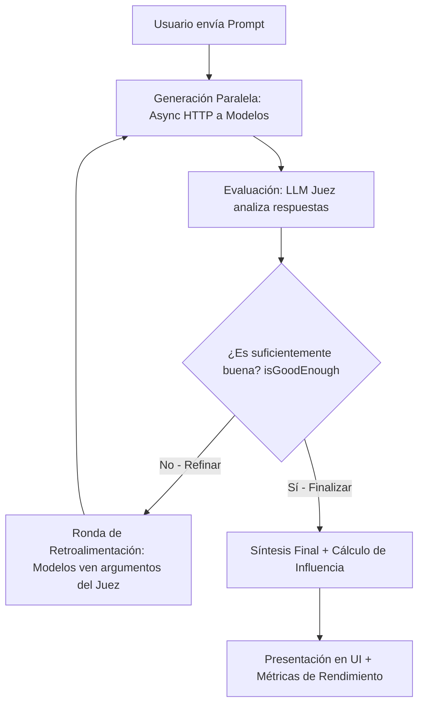

# Plan de Arquitectura y Roadmap: CortexHub byNapo

Este documento establece la base de diseño, decisiones críticas y plan de desarrollo para fusionar las capacidades de **Odysseus** (FastAPI, Agentes MCP, Cookbook) con la filosofía deliberativa de **ai-consensus** e ideas de **G0DM0D3** (Scoring, Métricas).

---

## 1. Reglas de Oro y Filosofía de Diseño (Odysseus Core)

Antes de implementar cualquier mejora, es crucial mapear y respetar los lineamientos y "reglas de oro" que el creador original dejó implícitos en la estructura de Odysseus:

1.  **Independencia Tecnológica y Zero-Build (Frontend Estático):**
    El frontend en `static/` es 100% código estático nativo (HTML/CSS/JS). No contiene compiladores, webpack, ni bundlers (como se confirma en el `package.json` libre de scripts de construcción). Esto permite que el archivo `index.html` sea abierto directamente mediante doble clic en local y funcione de forma autónoma. Cualquier mejora visual o cambio de idioma debe respetar este formato nativo.
2.  **Interactividad vía Iframe / Sandbox (Evitar GUIs Locales):**
    Odysseus no soporta interfaces de terminal interactivas (TTY) o GUIs basadas en Python (ej: Pygame, Tkinter) en su contenedor. Para cualquier herramienta interactiva, la regla de oro es generar un archivo HTML estático autocontenido con `<canvas>` y JS en línea, guardándolo con `create_document` para que el frontend lo previsualice en un iframe sandboxed interactivo.
3.  **Convención de Enlaces Dinámicos (Markdown Clickable Anchors):**
    Toda referencia que haga el agente a entidades del sistema (chats, documentos, tareas, notas, correos, habilidades, etc.) en sus respuestas finales debe formatearse obligatoriamente con enlaces dinámicos markdown específicos (ej: `[Nombre](#session-<id>)`, `[Título](#document-<id>)`, `[Nombre](#skill-<name>)`). El frontend lee estos hashes para abrirlos en las pestañas interactivas laterales.
4.  **Cifrado Ciego de Credenciales (Secret Storage):**
    Toda contraseña (SMTP/IMAP), llave de API y token OAuth de usuario se almacena Fernet-encriptada de forma transparente en la base de datos SQLite (`app.db`). La clave de cifrado reside físicamente en `data/.app_key` con permisos de seguridad restringidos (modo 0o600) y jamás debe agregarse a Git.
5.  **Aislamiento y Hardening de Prompts (Untrusted Context Policy):**
    Todo texto proveniente de fuentes externas (resultados web, correos leídos, RAG, memorias, skills) se considera **dato, no instrucción** y se encapsula estrictamente dentro de delimitadores `<<<UNTRUSTED_SOURCE_DATA>>>` para evitar inyecciones indirectas.
6.  **Escalación y Aprendizaje Dinámico (Teacher Escalation):**
    En modo agente, los fallos del modelo local/estudiante (Ollama) son detectados por Regex o LLMs, delegando de forma transparente en un modelo "Profesor" superior en la nube (SOTA). Este no solo recibe la consulta, sino que instila una habilidad duradera (`SKILL.md`) para que el estudiante aprenda a resolverlo solo en el futuro.
7.  **Compacción y Preservación de Contexto:**
    La ventana de contexto tiene un límite estricto de `MAX_CONTEXT_MESSAGES = 90`. Al superarlo, un proceso de compactor asíncrono destila el historial antiguo en un resumen estructurado para evitar la saturación de tokens y el olvido del agente.
8.  **Disciplina de Herramientas (No Overrides Genéricos):**
    Nunca deben usarse comandos de shell genéricos (`bash`/`python`) para tareas donde existan herramientas específicas provistas en el proyecto (ej: no usar `curl`/`requests` para buscar en la web, usar `web_search`/`web_fetch`; no usar `sed`/`awk`/`redirects` para modificar archivos, usar `edit_file` con diffs exactos).
9.  **Tareas Asíncronas en Segundo Plano (`#!bg`):**
    Cualquier comando en bash que tome más de 20s debe utilizar el tag `#!bg` en su primera línea para correr en segundo plano asíncronamente y no bloquear el chat.

---

## 2. Decisiones Críticas de Arquitectura (La Confrontación de Stacks)


Existe una contradicción entre el stack técnico definido en tu informe (`Next.js 16 + PostgreSQL + pgvector + Vercel AI SDK`) y el requisito de `"no romper el funcionamiento autónomo desde HTML"` heredado del proyecto Odysseus (`FastAPI + SQLite + HTML/JS estático`).

### Tabla Comparativa de Caminos

| Criterio | Ruta A: Híbrido Python/FastAPI (Mantener Core Odysseus) | Ruta B: Migración Next.js (Reescritura Completa) |
| :--- | :--- | :--- |
| **Funcionamiento Autónomo** | **Excelente.** El frontend sigue siendo HTML/JS estático (`/static`). Puede correr localmente haciendo doble clic y usar APIs del navegador o conectarse remotamente. | **Nulo.** Next.js requiere obligatoriamente un runtime de Node.js en el servidor. No se puede abrir haciendo doble clic en un archivo `index.html`. |
| **Consumo de Recursos (Nube)** | **Bajo.** Python + SQLite + ChromaDB consume aproximadamente ~1.5 GB de RAM. Corre de sobra en el plan gratuito de Oracle Cloud. | **Alto.** Node.js + PostgreSQL (con `pgvector` activo) + Next.js App Router consumen fácilmente 3-4 GB de RAM solo en reposo. |
| **Bucle de Agentes y MCP** | **Nativo.** Odysseus ya tiene integradas herramientas MCP, RAG, escaneo de hardware y Python CLI. Reescribir esto en Node.js es una tarea titánica. | **Complejo.** El ecosistema MCP y la integración de sistemas operativos locales (Cookbook) están mucho más maduros en Python. |
| **Base de Datos** | **SQLite (SQL simple).** Cifrado transparente con Fernet en reposo. Sin administración de servidores de bases de datos. | **PostgreSQL.** Excelente para producción multiusuario, pero añade costes y complejidad de respaldos de base de datos en caliente. |

### 💡 Recomendación Crítica (Ruta Híbrida Optimizada):
Para **mantener la simplicidad del usuario** y no perder el trabajo de Odysseus, el camino más inteligente es **mantener el backend de Python/FastAPI y SQLite**, pero **portar la lógica de Consenso de `ai-consensus` al backend de Python**. 

Implementaremos el frontend en la estructura de plantillas HTML/JS de Odysseus mediante componentes de Vanilla CSS/JS con alta estética (estilo Tailwind/shadcn), asegurando que el HTML estático local pueda seguir consumiéndose directamente.

---

## 3. Definición del Motor de Consenso (Bucle de Deliberación)

El flujo de Consenso IA se estructurará en el backend de FastAPI en 4 fases asíncronas:



### Detalle del Flujo de Consenso:
1.  **Generación Paralela:** Conexiones concurrentes asíncronas (`httpx.AsyncClient`) a los modelos correspondientes a cada tier (Fast, Standard, Smart, Code).
2.  **Evaluación (Juez LLM):** Un modelo clasificado como "Smart" (ej. GPT-4o o Claude) actúa como árbitro. Recibe las respuestas y genera un JSON bajo el siguiente esquema:
    ```json
    {
      "agreements": "Puntos de coincidencia absoluta.",
      "differences": "Áreas de contradicción o datos omitidos.",
      "isGoodEnough": true,
      "critique": "Breve análisis de sesgos o alucinaciones detectadas."
    }
    ```
3.  **Refinamiento Iterativo:** Si `isGoodEnough` es falso y no se ha superado el límite de rondas (máx 2), se envía a cada modelo la crítica del juez y las respuestas de sus competidores para que ajusten su respuesta.
4.  **Síntesis y Métricas de Influencia:** El Juez compila la respuesta unificada final y calcula la influencia de cada modelo basándose en:
    *   **Tokens adoptados** en la síntesis.
    *   **Menciones de coincidencia** en `agreements`.
    *   **Correcciones aportadas** en las rondas de refinamiento.

### 🛡️ Reglas de Seguridad y Eficiencia Aplicadas al Consenso:
1.  **Aislamiento de Respuestas de Modelos (Prevención de Inyecciones):**
    Dado que las respuestas de los modelos en el bucle de deliberación pueden contener inyecciones indirectas (provenientes de RAG, correos o búsquedas), el prompt que recibe el *Juez LLM* debe encapsular obligatoriamente las respuestas de los otros modelos dentro del marcador `<<<UNTRUSTED_SOURCE_DATA>>>`. Esto protege al Juez de ser manipulado por directivas maliciosas originadas en otros modelos.
2.  **Prevención de la Saturación de Contexto (Evitar Colapso del Compactador):**
    El bucle de consenso genera múltiples iteraciones (2-3 respuestas por ronda más las evaluaciones del juez). Guardar todo esto en el historial de chat de la sesión saturará de inmediato el límite de `MAX_CONTEXT_MESSAGES = 90` y activará el compactador de contexto de forma innecesaria, eliminando historial valioso.
    *   *Solución:* Las deliberaciones intermedias y respuestas crudas **no** se guardarán como mensajes ordinarios en la sesión. Se persistirán únicamente como metadatos estructurados (JSON) asociados al mensaje final o en la tabla de comparaciones. El chat principal solo registrará la pregunta del usuario y la síntesis final de consenso.
3.  **Uso de Conexiones Nativas (`llm_core`):**
    Las llamadas concurrentes deben ejecutarse a través de `llm_call_async` en el backend, heredando automáticamente las directivas de TLS, la auditoría de tokens y el cifrado de claves.

---

## 4. Especificación de Idiomas y Variables Visuales (Modo Autónomo)

Para cumplir con la filosofía de sencillez y soporte bilingüe sin romper el HTML local, estructuraremos la carga de recursos de la siguiente manera:

*   **Configuración Visual Dinámica (`static/js/ui_config.js`):**
    ```javascript
    const UI_DEFAULT_CONFIG = {
      appName: "CortexHub byNapo",
      theme: "dark-glass",
      defaultLang: "es"
    };
    ```
*   **Diccionario de Idiomas (`static/js/translations.js`):**
    ```javascript
    const TRANSLATIONS = {
      es: {
        welcome_title: "Panel de Consenso IA",
        input_placeholder: "Pregunta al grupo de agentes...",
        fast_tier: "Rápido"
      },
      en: {
        welcome_title: "AI Consensus Panel",
        input_placeholder: "Ask the agent group...",
        fast_tier: "Fast"
      }
    };
    ```
*   **Función de Traducción Local:**
    Un script JS ejecutará en el evento `DOMContentLoaded`:
    1. Comprobar idioma en `localStorage.getItem('lang')` o valor por defecto.
    2. Recorrer todos los elementos que posean el atributo `data-i18n` y reemplazar su contenido.
    3. Si el backend está disponible, guardará la preferencia del usuario mediante la llamada `/api/preferences` para mantener la consistencia entre dispositivos.

---

## 5. Despliegue en la Nube y Almacenamiento "Out-of-the-Box"

Para asegurar un arranque inmediato del servidor sin configuraciones complejas por parte de nuevos usuarios:

1.  **Cifrado de Datos y Credenciales (SQLite):**
    *   En lugar de exponer las credenciales en texto plano en la base de datos, utilizaremos el sistema de base de datos integrado de Odysseus de SQLAlchemy con decoradores `EncryptedText`.
    *   El archivo de llaves `data/.app_key` se generará automáticamente en el servidor la primera vez que se inicie el contenedor Docker, utilizando cifrado AES-256 (Fernet) de forma local.
2.  **Soporte Multiusuario Real:**
    *   Corte del entorno global: Desactivación de las variables globales de API en el `.env` de producción.
    *   El onboarding para un nuevo usuario solo requerirá registrarse en el sistema web y agregar sus credenciales individuales en el formulario de configuración, las cuales se guardarán bajo su propiedad (`owner`) en la base de datos relacional SQLite `app.db`.
3.  **Docker Compose Simplificado:**
    *   Un archivo de orquestación único que arranca el backend de Python, ChromaDB para el almacenamiento vectorial local, y SearXNG para búsquedas web locales.

---

## 6. Roadmap de Implementación (Ordenado por Complejidad)

```
┌────────────────────────────────────────────────────────────────────────┐
│ FASE 1: Estructuración de Interfaz e Idiomas                           │
│ └─ Implementación de localizaciones en JS (static/js/translations.js)   │
│ └─ Extracción de variables visuales de marca a un archivo config global │
│ └─ Modificación del layout de index.html para soportar el modo Bilingüe│
└────────────────────────────────────────────────────────────────────────┘
                                   │
                                   ▼
┌────────────────────────────────────────────────────────────────────────┐
│ FASE 2: Preparación del Entorno Cloud Híbrido                          │
│ └─ Configuración de volumen persistente y permisos en Docker           │
│ └─ Validación del sistema de cifrado de credenciales de usuario        │
│ └─ Programación del cron local para el script de backup automatizado   │
└────────────────────────────────────────────────────────────────────────┘
                                   │
                                   ▼
┌────────────────────────────────────────────────────────────────────────┐
│ FASE 3: Implementación del Motor de Consenso (FastAPI + JS)            │
│ └─ Creación de endpoints asíncronos paralelos para consulta múltiple   │
│ └─ Diseño del prompt estructurado y validación JSON del Modelo Juez    │
│ └─ Cálculo de métricas de influencia y guardado en app.db              │
└────────────────────────────────────────────────────────────────────────┘
```
